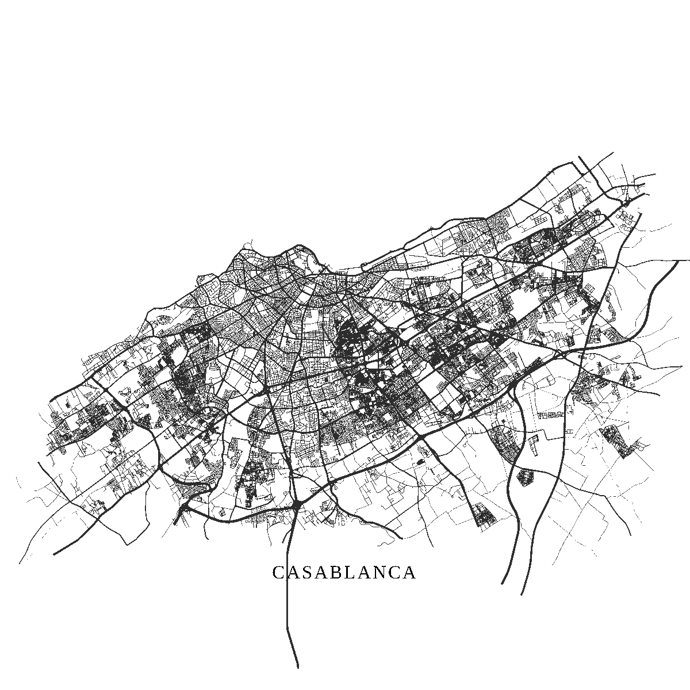

<h1 align="center">
  
  <br />
  <strong>City Lines</strong>
  <br />
  <em>Turn your city into minimalist street-network art.</em>
</h1>

<p align="center">
  <a href="https://citylines-art.vercel.app/"><strong>Live app</strong></a> ·
  <a href="#use-it-with-your-own-map-data">Self-host</a> ·
  <a href="#support-the-project">Support</a> ·
  <a href="https://github.com/abdel-mars/city-canvas/issues">Report an issue</a>
</p>

<p align="center">
  <a href="LICENSE"></a>
  <a href="https://citylines-art.vercel.app/"></a>
  
  
  
  <a href="https://www.openstreetmap.org/copyright"></a>
</p>

---

Search for any city on Earth and watch its road network resolve into a piece of minimalist
wall art. Adjust the mood, the typography and the framing, then download it as a crisp PNG or
SVG — or have it printed on museum-grade matte paper and shipped anywhere in the world.

<p align="center"></p>

## What it does

- **Any city, anywhere** — search a place name and its streets are fetched live from OpenStreetMap
- **Real cartography, not a texture** — genuine road geometry, simplified with Douglas–Peucker
- **Six moods** — Classic, Minimal, Sand, Navy, Mars and a neon preset
- **Four typefaces** — Cormorant Garamond, DM Sans, JetBrains Mono and Caveat
- **Export anywhere** — PNG (up to 4000px), transparent-background PNG, or raw vector SVG
- **Print on demand** — order a real square-format poster through Printify without leaving the page

<p align="center">
  
</p>

## Quick start

Requires **Node 20 or newer**.

```bash
git clone https://github.com/abdel-mars/city-canvas.git
cd city-canvas
npm install
cp .env.example .env      # then fill in GEOCONTACT at minimum
npm run dev               # http://localhost:8080
```

The artwork editor works with nothing but `GEOCONTACT` set. Everything else — caching,
printing, accounts — is optional and degrades gracefully.

| Script | What it does |
| --- | --- |
| `npm run dev` | Dev server on port 8080 |
| `npm run build` | Production build into `dist/` |
| `npm run preview` | Serve the production build locally |
| `npm test` | Run the test suite (Vitest) |
| `npm run lint` | Lint with ESLint |

## Use it with your own map data

This is the part worth reading. City Lines is deliberately small and readable, and every piece
of geography is swappable.

### Point it at your own Overpass instance

The public servers at `overpass-api.de` are shared, rate-limited infrastructure. If you run your
own — or a paid provider — edit the mirror list at the top of `api/geo.ts`:

```ts
const OVERPASS_MIRRORS = [
  'https://overpass.kumi.systems/api/interpreter',
  'https://z.overpass-api.de/api/interpreter',
  'https://overpass.private.coffee/api/interpreter',
  'https://overpass-api.de/api/interpreter',   // keep the public one as a last resort
];
```

The proxy tries them in order, remembers whichever last worked, and fails over after 8 seconds.
Add yours to the front and it becomes the primary.

> **This must stay server-side.** Browsers cannot set a `User-Agent` header, and Overpass
> refuses browser clients with a `406` whose error page carries no CORS headers — so the failure
> shows up in the console as a bogus *"blocked by CORS policy"* message. Moving the request into
> a serverless function is the only thing that makes it work.

### Swap the place search

City names come from Nominatim (`NOMINATIM_URL` in `api/geo.ts`). To use your own gazetteer, a
GeoJSON index, or a fixed list of cities, either point that constant at your service or bypass
it entirely and return `City[]` objects yourself:

```ts
interface City {
  name: string;
  displayName: string;
  lat: number;
  lon: number;
  boundingBox: [number, number, number, number];  // south, west, north, east
}
```

Then call your own endpoint from `src/hooks/useCitySearch.ts` instead of `/api/geo`.

### Change the look

All of the visual identity lives in `src/lib/presets.ts`:

- `colorPresets` — the six colour moods
- `fontMap` / `fontLabels` — the four typefaces
- `featuredCities` — the cities behind the landing-page background art

Add a preset, drop a Google Font into `index.html`, and you have a new mood.

### Tune the geometry

In `api/geo.ts`:

- `MAX_BBOX_SPAN` (default `0.35°`) rejects metro-sized boxes that would time out
- `EPSILON` (default `0.00005`, ≈5 m) controls line simplification — raise it for a lighter,
  faster render
- `MAX_WAYS` / `MAX_POINTS` cap the payload

### Drop the print shop entirely

The Printify integration is completely optional. For a pure download tool, delete
`api/create-printify.ts` and remove the *Gift it* button and its confirmation dialog from
`src/components/DownloadShare.tsx`. Nothing else depends on it, and no Printify account is
needed.

To keep printing but use your own store, point `PRINTIFY_API_KEY`, `PRINTIFY_SHOP_ID` and
`PRINTIFY_STORE_DOMAIN` at your own account. The poster is created from blueprint `282`
("Matte Vertical Posters") with square sizes only, because the artwork is 1:1.

## Configuration

Every variable is documented in [`.env.example`](.env.example). Nothing secret is ever prefixed
with `VITE_`, so nothing secret can reach the browser.

| Variable | Required | Purpose |
| --- | --- | --- |
| `GEOCONTACT` | **Yes** | Your email or URL, sent as the `User-Agent` when calling Overpass. Overpass permanently bans clients that do not identify themselves, so there is no safe default. |
| `APP_ORIGIN` | Yes | Absolute origin of your deployment. CORS is locked to exactly this string. |
| `UPSTASH_REDIS_REST_URL` | Recommended | Redis cache. Without it the proxy falls back to per-instance memory, which is far less effective. |
| `UPSTASH_REDIS_REST_TOKEN` | Recommended | As above. |
| `PRINTIFY_API_KEY` | Optional | Personal Access Token. Needed only for the print shop. |
| `PRINTIFY_SHOP_ID` | Optional | Numeric shop id of your Pop-Up Store. |
| `PRINTIFY_STORE_DOMAIN` | Optional | Your store subdomain, without `.printify.me`. |
| `PRINT_PROVIDER_ID` | Optional | Pins a print provider instead of using the catalog's first. |
| `INCLUDE_LARGE` | Optional | `true` also offers the 28″×28″ poster, which has a much higher base cost. |
| `VITE_SUPABASE_URL` | Optional | Only for the account and gallery features. |
| `VITE_SUPABASE_PUBLISHABLE_KEY` | Optional | Supabase anon key. Safe to ship; RLS is the real access control. |
| `VITE_SUPABASE_PROJECT_ID` | Optional | Supabase project ref. |

## How it works

```
Browser ──POST /api/geo──────────► Vercel function ──► Overpass / Nominatim
                                        │
                                        ├─ 6 mirrors, 8s timeout, sticky winner
                                        ├─ Redis cache: one fetch per city, forever
                                        ├─ single-flight: 5 callers → 1 upstream request
                                        ├─ rate limit 60/hr/IP, serves stale when over
                                        └─ simplify + compact [lat, lon] tuples

Browser ──POST /api/create-printify──► Vercel function ──► Printify API
                                        │
                                        ├─ dedupe by design-hash tag
                                        ├─ square poster sizes, priced above cost
                                        └─ polls for the storefront URL
```

Two details worth knowing if you plan to modify it:

**The storefront URL cannot be guessed.** Printify's API returns a Mongo ObjectId
(`6a21115f…`) but the Pop-Up Store needs a numeric id (`29074930`). That numeric id only appears
in `product.external.handle` *after* publishing, so the endpoint publishes and then polls for it.
Building the URL yourself produces a 404.

**The user's IP is read from the rightmost `X-Forwarded-For` entry.** The leftmost entries are
client-supplied; trusting them lets anyone mint a fresh rate-limit bucket with one header.

## Deploying

The app is a standard Vite build with an `api/` directory, so it deploys cleanly to
[Vercel](https://vercel.com) with no configuration:

```bash
npx vercel
```

`vercel.json` handles the SPA rewrite for client-side routes while leaving `/api/*` alone.

To deploy anywhere else, build with `npm run build` and serve `dist/` as a static site, and
deploy `api/` as Node 20+ serverless functions. Remember to set `GEOCONTACT` and `APP_ORIGIN`.

## Troubleshooting

| Symptom | Cause |
| --- | --- |
| *"blocked by CORS policy"* on the Overpass URL | Misleading. The real status is `406`: something is calling Overpass from a browser. Route it through `/api/geo`. |
| Road data never loads, endpoint returns `503` | `GEOCONTACT` or the Redis credentials are missing. The proxy fails closed rather than hammer the upstream unidentified. |
| `"Printing is unavailable"` | `PRINTIFY_API_KEY` or `PRINTIFY_SHOP_ID` is unset. |
| Searches return `429` | 60 requests/hour per IP. Past the cap the proxy serves a stale cached copy when it has one. |
| Large cities come back empty | The bounding box exceeded `MAX_BBOX_SPAN`. Nominatim returns administrative areas, which can be much bigger than the city. |

## Support the project

City Lines is free and open source. If it gave you something you like:

- **Get your own city** → [citylines-art.vercel.app](https://citylines-art.vercel.app/)
- **Gift a real print** → [citylines-art.printify.me](https://citylines-art.printify.me/)

## Credits

- Street and place data © [OpenStreetMap contributors](https://www.openstreetmap.org/copyright),
  available under the [Open Database License](https://www.openstreetmap.org/copyright) (ODbL)
- Typefaces: [Cormorant Garamond](https://fonts.google.com/specimen/Cormorant+Garamond),
  [DM Sans](https://fonts.google.com/specimen/DM+Sans),
  [JetBrains Mono](https://fonts.google.com/specimen/JetBrains+Mono),
  [Caveat](https://fonts.google.com/specimen/Caveat)
- Print-on-demand fulfilment by [Printify](https://www.printify.com)
- Built with [React](https://react.dev), [Vite](https://vite.dev),
  [Tailwind CSS](https://tailwindcss.com) and [shadcn/ui](https://ui.shadcn.com)

### A note on OpenStreetMap

This project uses publicly donated geography and relies on free community infrastructure.
Overpass asks that you identify yourself, keep request volume low, and avoid parallel retries;
the caching, mirroring and rate limiting here exist partly to honour that. If you deploy this,
please keep `GEOCONTACT` set to a real address and consider
[donating to OpenStreetMap](https://openstreetmap.org/donate) or running your own Overpass
instance. Attribution must be preserved if you redistribute rendered output.

## License

MIT © [El Mahmoudi Abderrahman](https://github.com/abdel-mars) — see [LICENSE](LICENSE).

You are free to use, modify and redistribute this project, including commercially. Attribution
is appreciated but the only requirement is keeping the copyright notice.
